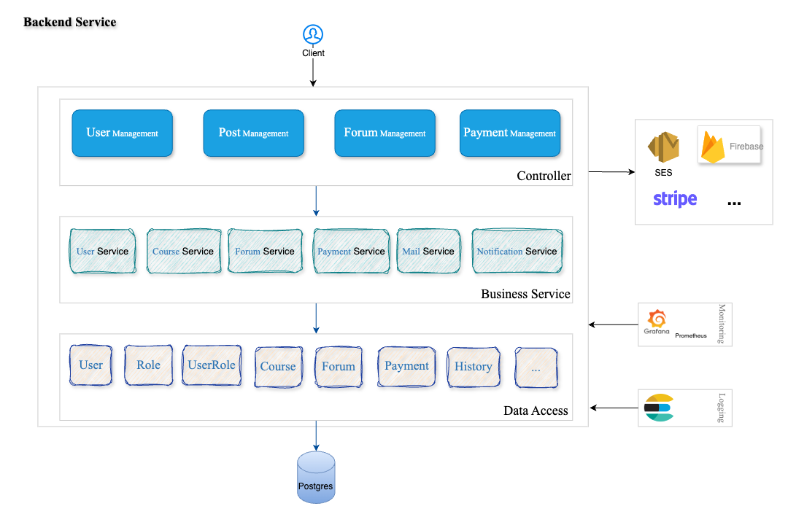

# CI/CD Pipeline Documentation

This document describes the CI/CD process using **Jenkins**, **Maven**, **Docker**, and **AWS EC2**. The pipeline automates testing, packaging, Docker image building, and deployment to EC2.

---

## Prerequisites

Before using this pipeline, ensure the following are ready:

* Jenkins is installed and configured.
* Required Jenkins plugins are installed:

    * Pipeline
    * Docker Pipeline
    * SSH Agent Plugin
    * Git Plugin
* Docker Hub account.
* EC2 instance (Linux) with Docker installed and port 9090 open.
* Necessary credentials created in Jenkins.

---

## Jenkins Required Credentials

| ID                   | Type              | Description                     |
| -------------------- | ----------------- | ------------------------------- |
| GitHub               | Username/Password | Access to GitHub repository     |
| database-credentials | Username/Password | PostgreSQL database credentials |
| Dockerhub1           | Username/Password | Docker Hub login                |
| aws-ec2-key          | SSH Private Key   | SSH key to connect to EC2       |
| ec2-host             | Secret Text       | EC2 public IP or hostname       |
| ec2-user             | Secret Text       | SSH username (e.g., `ubuntu`)   |

---

## Environment Variables in Pipeline

```env
DB_HOST=aws-0-ap-southeast-1.pooler.supabase.com
DB_PORT=5432
DB_NAME=postgres

APP_NAME=backend-service
RELEASE=1.0.0
IMAGE_NAME=huypqse/backend-service
IMAGE_TAG=1.0.0-${BUILD_NUMBER}
```

---

## Pipeline Stages

| Stage                     | Description                                             |
| ------------------------- | ------------------------------------------------------- |
| Clean workspace           | Clean workspace before each build                       |
| Checkout from SCM         | Clone source code from GitHub                           |
| Check Workspace           | Verify directory structure                              |
| Test Application          | Run unit tests using DB connection info                 |
| Build Application         | Build project with Maven and DB config                  |
| Build & Push Docker Image | Create Docker image, tag, and push to Docker Hub        |
| Deploy to AWS EC2         | SSH into EC2, pull new image, and run updated container |

---

## Project Folder Structure

```
project-root/
├── ci-cd/                # Main source code
│   ├── Dockerfile
│   ├── src/
│   └── pom.xml
├── Jenkinsfile           # Pipeline script
└── README.md             # Project documentation
```

---

## Technical Stack

* Java 17
* Spring Boot 3.2.3
* PostgreSQL
* Kafka
* Redis
* Maven 3.5+
* Lombok
* Spring DevTools
* Docker / Docker Compose

---

## Build Application

```bash
mvn clean package -P dev|test|uat|prod
```

---

## Run Application

**Using Maven:**

```bash
./mvnw spring-boot:run
```

**Using JAR file:**

```bash
java -jar target/backend-service.jar
```

**Using Docker:**

```bash
docker build -t backend-service .
docker run -d -p 9090:9090 backend-service
```

---

## Package Application (Docker Image)

```bash
docker build -t backend-service .
```

---

## Successful Deployment to EC2?

Console log will show:

```
Application deployed successfully to EC2.
```

You can then access the application at: `http://<EC2_PUBLIC_IP>:9090`

---

## Docker Clean-up on EC2

After deployment, the pipeline runs:

```bash
docker image prune -af --filter "until=24h"
```

\=> Cleans up Docker images older than 24 hours to prevent disk space issues.

---

## Troubleshooting Pipeline Errors

* Check Jenkins Console Output logs.
* SSH into EC2 and inspect Docker logs:

```bash
docker ps -a
docker logs backend-service
```

---

## References

* [Install JDK](https://tayjava.vn/cai-dat-jdk-tren-macos-window-linux-ubuntu/)
* [Install Maven](https://tayjava.vn/cai-dat-maven-tren-macos-window-linux-ubuntu/)
* [Install IntelliJ](https://tayjava.vn/cai-dat-intellij-tren-macos-va-window/)
* [Jenkins Pipeline Documentation](https://www.jenkins.io/doc/book/pipeline/)

---

## Author

* **Phan Quang Huy** – [GitHub](https://github.com/huypqse)
